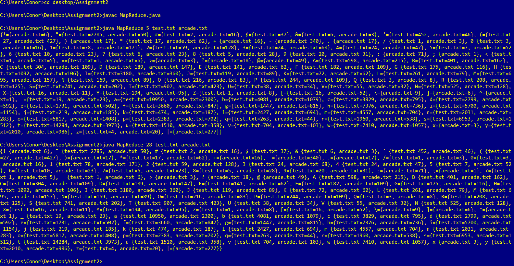

# Map-Reduce-characters
The code for an assignment in which we had to use a MapReduce algorithm using a thread pool and multithreading in order to figure out how many times
a character turns up in a text file. tested using two large text files from the internet, arcade.txt and test.txt

